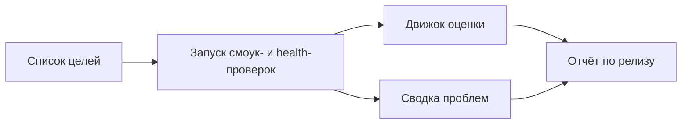

# Архитектура: Release Rescue Kit

```mermaid
flowchart LR
    A["Список целей"] --> B["Запуск смоук- и health-проверок"]
    B --> C["Движок оценки"]
    B --> D["Сводка проблем"]
    C --> E["Отчёт по релизу"]
    D --> E
```

## Ключевая идея

Первым делом фиксируется не "как починить всё", а какие пользовательские сценарии живы, какие сломаны и где риск выше всего.

